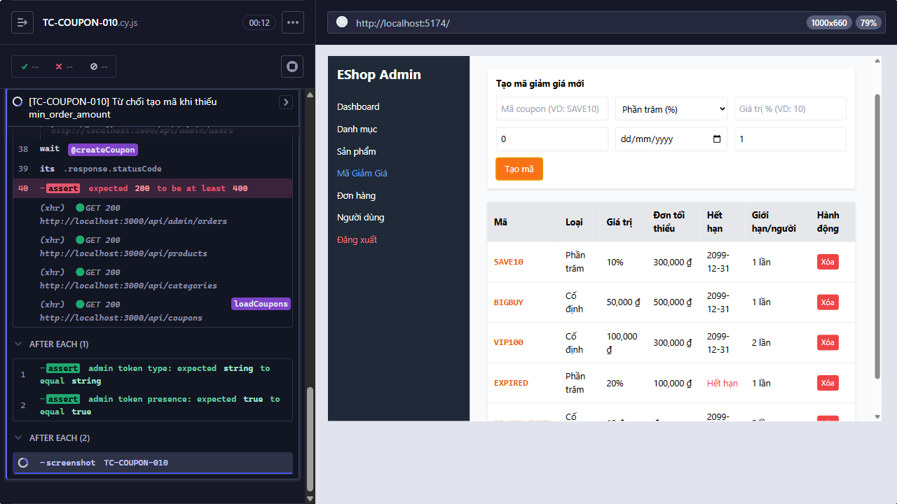

Title: [BUG][Coupon] Từ chối tạo mã khi thiếu min_order_amount

## Found by Test Case
TC-COUPON-010

## Requirement liên quan
FR-17

## Severity / Priority
TBD / TBD

## Environment
- Browser: Electron 146.0.7680.216 (headless)
- OS: Windows NT 10.0.26200
- URL: http://127.0.0.1:5174
- Build/commit: 9677c31
- Run window (UTC): 2026-10-14T03:45:46.864Z to 2026-10-14T03:53:28.206Z

## Steps to reproduce
1. Nhập các field theo Test data, để trống `Đơn tối thiểu (₫)`.
2. Bấm `Tạo mã`.

## Expected result
Từ chối tạo vì thiếu `min_order_amount`.

## Actual result
AssertionError: Timed out retrying after 8000ms: expected 200 to be at least 400

## Evidence

