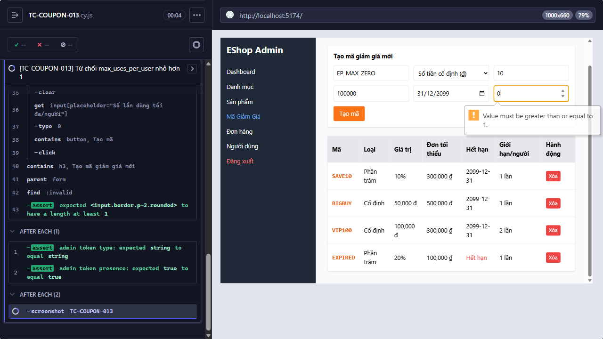

Title: [PASS][Coupon] Từ chối max_uses_per_user nhỏ hơn 1

## Found by Test Case
TC-COUPON-013

## Requirement liên quan
FR-17

## Severity / Priority
N/A / N/A

## Environment
- Browser: Electron 146.0.7680.216 (headless)
- OS: Windows NT 10.0.26200
- URL: http://127.0.0.1:5174
- Build/commit: 9677c31
- Run window (UTC): 2026-10-14T03:45:46.864Z to 2026-10-14T03:53:28.206Z

## Steps to reproduce
1. Nhập `0` vào `Số lần dùng tối đa/người` và nhập đúng các field còn lại theo Test data.
2. Bấm `Tạo mã`.

## Expected result
Từ chối tạo vì `max_uses_per_user < 1`.

## Actual result
Cypress ghi nhận trạng thái cuối cùng passed.

## Evidence

